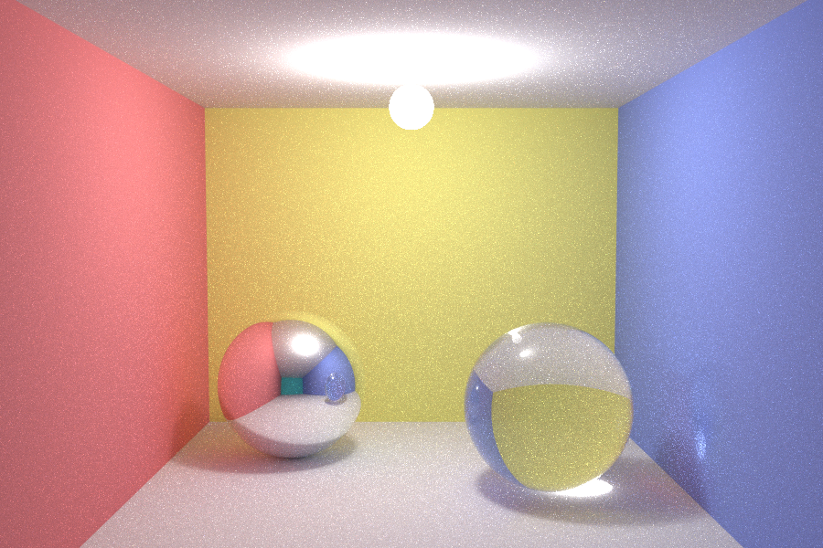

# Vulkan Minimal Compute

This is a simple demo that demonstrates how to use Vulkan compute shaders to calculate the Mandelbrot set on the GPU. **The code is heavily commented, so it can be seen as a rough getting-started tutorial for using Vulkan compute shaders**.

The only depdendencies are Vulkan and `lodepng`, which is merely used for png encoding. The Vulkan SDK can be installed from `lunarg.com`

# Demo

The application launches a compute shader that calculates the Mandelbrot set, and writes resulting pixels into a storage buffer.
The storage buffer is then transferred from GPU- to CPU memory, and saved as `.png`.

# Building

The project uses a bare-bones Makefile, which can also be run on Windows using `mingw32-make -f Makefile.win32` (tested with [tdm-gcc v10.3.0](https://jmeubank.github.io/tdm-gcc/) installation on Windows 10). 

# Running

When running the created program, the png file `mandelbrot.png` is created. 
